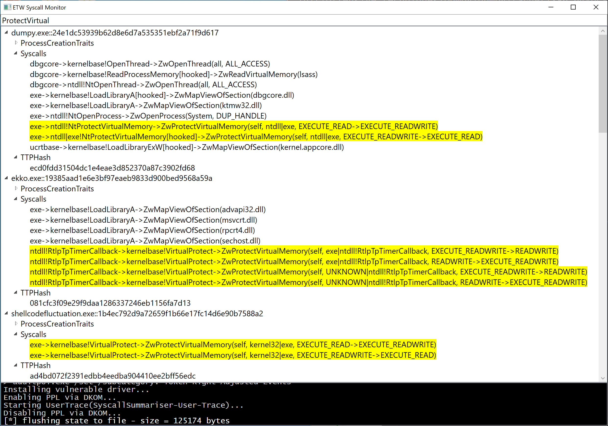



# Hunting hidden shellcode via syscall summaries

You can roughly determine an executable's purpose from its Import Table (or [ImpHash](https://www.mandiant.com/resources/blog/tracking-malware-import-hashing)).
 Or, better yet, from a summary of its [capa](https://github.com/mandiant/capa)bilities extracted by automated static analysis of callsites and parameters.

This project is the *runtime* equivalent.

Using kernel ETW telemetry, we record the set of interesting syscalls (plus interesting parameters).

Malware can't use anti-analysis approaches to hide from the kernel at runtime. If (user-mode) malware needs to make syscalls to perform tasks then it must make those calls.

Anomalies in this set for a given process should have sufficient information to identify the presence of malicious code on the system. However, the profile will not have sufficient granularity to establish a perfect timeline of events.

See [[Black Hat Asia 2023] You Can Run, but You Can't Hide - Finding the Footprints of Hidden Shellcode](https://www.blackhat.com/asia-23/briefings/schedule/index.html#you-can-run-but-you-cant-hide---finding-the-footprints-of-hidden-shellcode-31237) for more details.

#### Notes
 * I'm not a UX developer.
 * This is a rough proof of concept.
 * For best results, run on Windows 10.
 * Uses BYOVD to enable PPL in order to collect Microsoft-Windows-Threat-Intelligence events
 * Periodically outputs a whole system `SyscallSummary.json` to the current directory
 * Periodically outputs per-process profiles to `SycallSummaries\%executable%__%startup_hash%.json`
